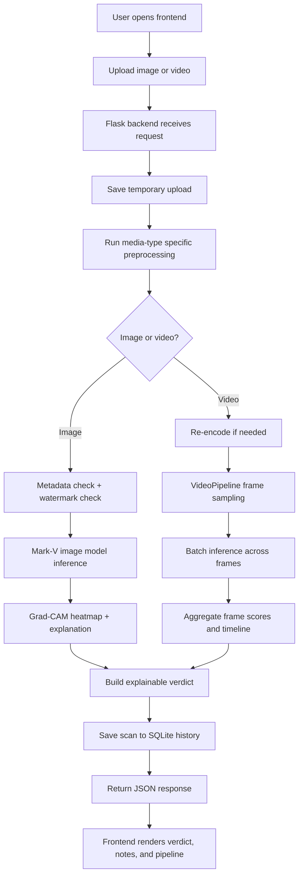

# Deepfake Detection System Project Architecture

This document explains the project from top to bottom: the user interface, backend API, model pipeline, dataset expectations, storage, and the final result flow.

## 1. What The Project Does

Deepfake Detection System is a local deepfake detection system for images and videos. It accepts uploaded media, runs visual analysis plus authenticity checks, builds an explainable verdict, stores the scan in a local database, and renders the result in the frontend.

The system is designed to work fully offline after setup. It does not depend on a cloud inference API.

## 2. High-Level End-To-End Flow

## 3. Repository Layout

- [backend/](backend/) contains the Flask server, scan APIs, database integration, and authenticity checks.
- [frontend/](frontend/) contains the upload page, result page, styles, and live UI logic.
- [model/](model/) contains the Mark-V model code, inference pipeline, and checkpoint files.
- [Documentation/](Documentation/) contains supporting notes and advanced usage material.

## 4. Backend Flow

The backend entry point is [backend/app.py](backend/app.py).

### Image path

1. The upload page sends a file to `POST /api/predict`.
2. The backend saves the upload in a temporary folder.
3. The image is resized and normalized with Albumentations.
4. Metadata and watermark checkers run first.
5. The Mark-V image model runs on the preprocessed tensor.
6. A Grad-CAM heatmap is generated from the RGB branch for explanation.
7. The backend combines the numeric score, metadata signals, and explanation text into a structured result.
8. The scan is saved into the SQLite history database.
9. The frontend receives the JSON response and renders the report.

### Video path

1. The upload page sends a file to `POST /api/predict_video`.
2. The backend saves the video and optionally re-encodes it with ffmpeg for safer playback.
3. The `VideoPipeline` in [model/src/video_inference.py](model/src/video_inference.py) decodes frames.
4. Frames are sampled, batched, and passed through the model.
5. The pipeline aggregates frame-level scores into a single verdict.
6. A timeline and confidence summary are returned.
7. The result is stored in history and rendered in the frontend.

## 5. Image Model Architecture

The image detector is the `DeepfakeDetector` class in [model/src/models.py](model/src/models.py).

It uses four branches:

- RGB branch: EfficientNet-V2-S for spatial artifact detection.
- Frequency branch: custom CNN over FFT features.
- Patch branch: local patch encoder for small inconsistencies.
- ViT branch: Swin V2 Tiny for global context.

The branch outputs are fused and passed through a classifier head that produces one sigmoid score. The backend interprets that score as a fake probability.

## 6. Video Pipeline Architecture

The video pipeline is in [model/src/video_inference.py](model/src/video_inference.py).

Core steps:

- Decode the video with Decord if available.
- Fall back to OpenCV if Decord is not installed.
- Sample frames at a configured rate.
- Detect faces and preprocess each selected frame.
- Run batch inference on frame groups.
- Aggregate the frame probabilities.
- Build a verdict, suspicious frame list, and timeline.

The backend also streams live progress updates to the frontend through the process tracker.

## 7. Live Process Tracking

The backend keeps a temporary in-memory process store for each upload.

It records:

- process id
- media type
- status
- progress percentage
- step messages
- timestamps

The frontend polls `GET /api/process/<process_id>` and shows the steps while the upload is being analyzed.

## 8. Authenticity Checks

For images, the backend runs two extra checks before finalizing the result:

- Metadata checker: looks for C2PA / provenance-style signals and AI-generation metadata.
- Watermark checker: looks for invisible watermark traces, especially Stable Diffusion-related markers.

These checks are combined with the model output to produce the final explanation.

## 9. Data And Dataset Expectations

The repository does not ship a training dataset. It expects a local dataset root when you train or compare models.

The configuration in [model/src/config.py](model/src/config.py) points to a dataset directory through `DEEPFAKE_DATA_DIR` or a local `model/data` folder.

From the repo notes and training utilities, the model family is described as being trained on a broad multi-source corpus, including:

- FaceForensics++ style manipulation data
- Synthetic image sources such as Stable Diffusion
- Other GenAI sources such as Midjourney and DALL-E

In practice, that means the model is intended to generalize across both traditional face manipulation and newer AI-generated content.

## 10. Storage And Outputs

The project stores results locally:

- `backend/uploads/` for temporary uploads during analysis
- `frontend/history_uploads/` for scan history media
- `backend/database.db` for scan metadata and feedback
- `backend/feedback_images/` for retraining or review artifacts

## 11. Frontend Result Flow

The frontend upload page is [frontend/analysis.html](frontend/analysis.html).

The result page uses [frontend/video_result.html](frontend/video_result.html) and [frontend/video_result.js](frontend/video_result.js).

The UI shows:

- verdict card
- confidence score
- detection notes
- analysis pipeline summary
- live backend steps during upload
- timeline or heatmap depending on media type

## 12. Core Runtime Dependencies

Important runtime packages used by the backend include:

- Flask
- Flask-Cors
- PyTorch
- torchvision
- OpenCV
- Albumentations
- Pillow
- safetensors
- SQLite through the built-in `database` module

## 13. Summary

In short, the flow is:

1. Upload media in the frontend.
2. Flask backend receives and saves it.
3. Image or video pipeline runs.
4. Mark-V produces the core score.
5. Metadata and watermark checks add evidence.
6. The backend builds an explainable verdict.
7. The result is stored and shown in the UI.

That is the complete end-to-end architecture of the current project.

